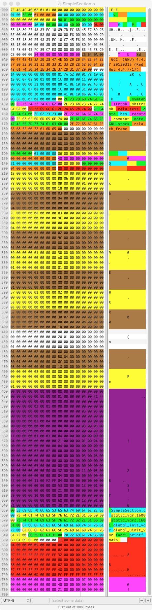

# ElfReader
ELF 文件解析程序

> 说明: 用Java解析 ELF 不是一个好的idea, 特别是对于字节序, 无符号数 , 以及内存对齐等相关的操作处理
> 比较难受,特别是对于BYTE类型居然是有符号的. 这个在做字节扩展的时候,踩了很多坑. 另外定义对象头等处理
> 也不如C语言写起来自然. 权当给大家用作分析 ELF相对验证使用. 

## 项目内容说明

> 这是一个解析ELF文件的Demo程序,主要是用于学习Linux ELF文件的基本构成, 
> 从自己解析的角度弄明白一个ELF文件的结构是怎样构成的. 这样可以更深刻的理解其布局.
> 作者曾经解析过CLASS文件的基本格式, 这个可以看作C++版本的`class`文件解析.

## 原文件二进制映射

## 解析结果

## 关于文件结构的一些参考:

0. [ELF Header - ch4.eheader](https://refspecs.linuxfoundation.org/elf/gabi4+/ch4.eheader.html)
1. [ELF Header - elfid](https://refspecs.linuxfoundation.org/elf/gabi4+/ch4.eheader.html#elfid)
2. [elf-64-object-file-4-elf-64-object-file-format-version-14-file-header-eidenteimag0](https://documents.pub/document/elf-64-object-file-4-elf-64-object-file-format-version-14-file-header-eidenteimag0.html)
3. [ELF-64 Object File Format - 上一个可以直接下载的版本](http://www.staroceans.org/e-book/elf-64-hp.pdf)
4. [什么是ELF - 博客园(征途)](https://www.cnblogs.com/lwyeric/p/13582022.html)
5. [ELF文件格式解析 - 博客园(征途)](https://www.cnblogs.com/lwyeric/p/13582112.html#elf_header)
6. [ELF解析器 - 开源 - github](https://github.com/horsicq/XELFViewer)